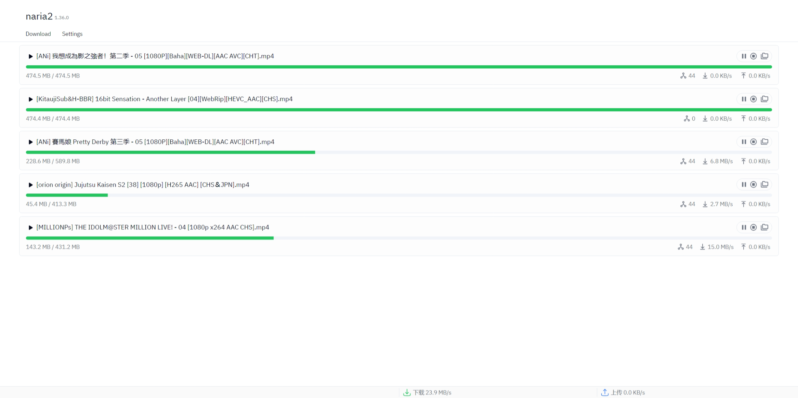

# naria2

[](https://www.npmjs.com/package/naria2)
[](https://www.npmjs.com/package/naria2c)
[](https://www.npmjs.com/package/vite-plugin-naria2)
[](https://github.com/yjl9903/naria2/actions/workflows/ci.yml)

High-level and Convenient BitTorrent Client based on [aria2 JSON RPC Interface](https://aria2.github.io/manual/en/html/aria2c.html#rpc-interface).

+ Download aria2 for your platform
+ Simple BitTorrent downloading API
+ Event bus for progress, state change, and so on
+ Vite plugin which helps you develop aria2 client application
+ Web UI for aria2c (more features is working in progress)



## Cross-platform aria2c

It is used in the same way as [aria2c](https://aria2.github.io/manual/en/html/aria2c.html#aria2c-1).

```bash
$ npm i -g naria2c

$ naria2c --version
naria2c/0.0.15
--------------
...

$ naria2c --help
```

You can also launch a Web UI to manage aria2 using the `--ui` option. This feature is provided by this package, not the original aria2.

```bash
$ naria2c --ui
...
10/29 21:22:46 [NOTICE] WebUI is listening on the http://127.0.0.1:6801?port=6800&secret=123456
...
```

## Installation

### Browser

```bash
npm i naria2
```

Using WebSocket:

```ts
import { createClient } from 'naria2'

const client = await createClient(
  new WebSocket('ws://localhost:6800/jsonrpc')
)
```

Using HTTP:

```ts
import { createClient } from 'naria2'
import { createHTTP } from 'naria2/transport'

const client = await createClient(
  createHTTP('http://localhost:6800/jsonrpc')
)
```

### Node.js standalone

If you want to use naria2 in the Node.js standalone, you can install `@naria2/node`. It has included a [prebuilt aria2 binary](https://github.com/agalwood/Motrix/tree/master/extra) according to your architecture, so that there is no need to install a [aria2](https://github.com/aria2/aria2) on your own.

```bash
npm i naria2 @naria2/node
```

You can use the `createChildProcess` API to spawn an aria2 child process, and connect to it in WebScoket under the hood.

```ts
import { createClient } from 'naria2'
import { createChildProcess } from '@naria2/node'

const client = await createClient(createChildProcess())
```

> **Warning**
>
> You should **close the client on your own**, otherwise the aria2 process **may not be killed** even if your program finished or crashed.
>
> See [my blog post (in Chinese)](https://blog.onekuma.cn/death-of-a-node-process) or [The Death of a Node.js Process (in English)](https://thomashunter.name/posts/2021-03-08-the-death-of-a-nodejs-process) on how to handle the exit of a Node.js process.

## Usage

```ts
import { createClient } from 'naria2'

// Initialize a client
const client = await createClient(
  new WebSocket('ws://localhost:6800/jsonrpc')
)

// Start downloading a magnet
const torrent = await client.downloadUri('...')

// Watch metadata progress
await torrent.watch((torrent) => {
  console.log(`Downloading [MEATADATA]`)
})
// Watch torrent progress
await torrent.watchFollowedBy((torrent) => {
  console.log(`Downloading ${torrent.name}`)
})

// Shutdown client
await client.shutdown()
```

Due to the implementation of [aria2](https://aria2.github.io/manual/en/html/index.html), the downloading progress of a magnet uri includes **two steps**:

1. Download the torrent metadata which contains only a special file named `[METADATA]`;
2. Download the torrent content itself.

So that, in the above code, you should first wait for downloading metadata, and then wait for downloading the followed by task which is the torrent content itself.

You can find an example using Node.js [here](https://github.com/yjl9903/naria2/blob/main/scripts/download.mjs).

## Credits

+ [aria2](https://github.com/aria2/aria2): A lightweight multi-protocol & multi-source, cross platform download utility operated in command-line
+ [@hydrati](https://github.com/hydrati) made [maria2](https://github.com/hydrati/maria2)
+ [Motrix](https://github.com/agalwood/Motrix): Build aria2 binaries for different platforms

## License

MIT License © 2023 [XLor](https://github.com/yjl9903)
